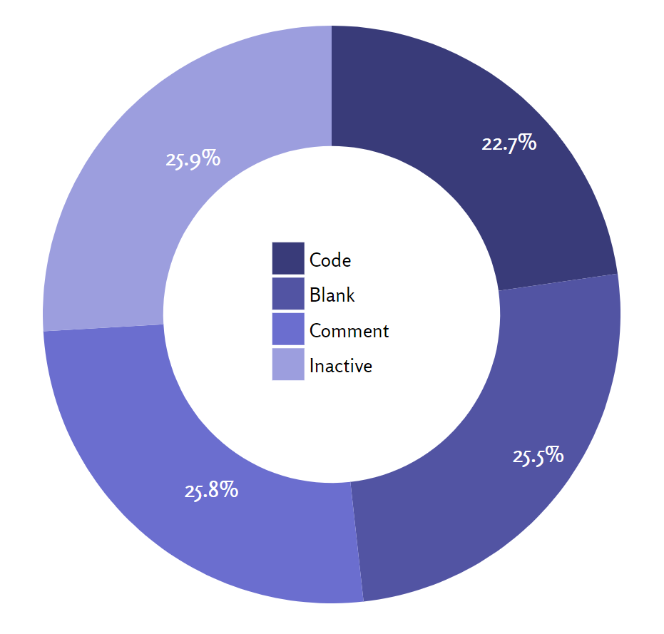

# codesize
This project visualizes the size of a code base. It visualizes the metrics: lines of code, blank lines, comment lines and inactive lines from a csv file.

# usage
1. Run the tool <a href="http://cloc.sourceforge.net/">cloc</a> in a directory: `cloc <directory>`
1. Put the metrics in a csv file and place the csv file in the same directory as the html file.
1. Start a web server: `python -m http.server 8000`
1. In your browser goto `localhost:8000`

# example output

